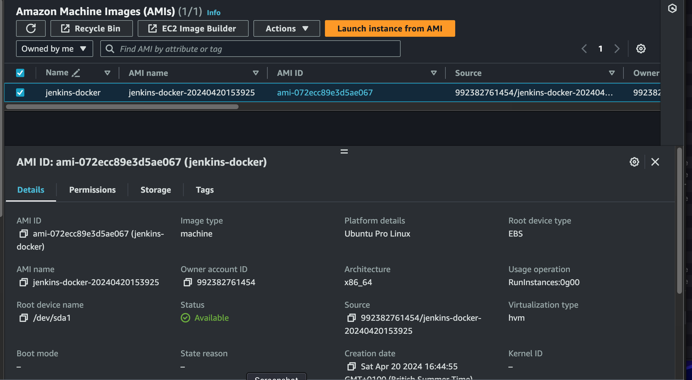
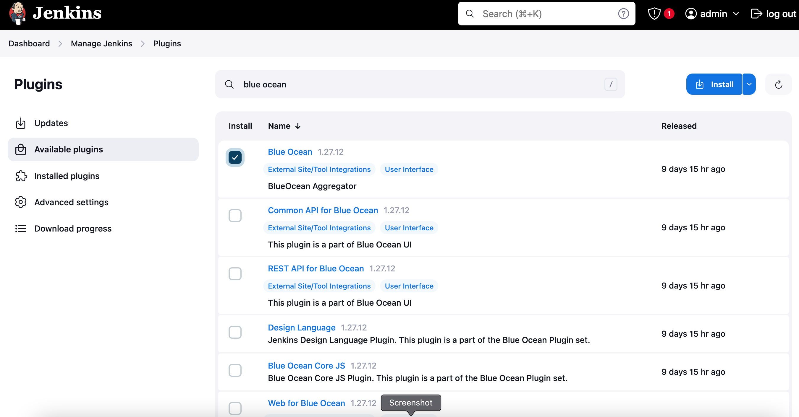

pull mongoDb image
```
docker pull mongo
```
pull mongo-express UI
```
docker pull mongo-express
 ```       
- we are suppose to create a docker network for them to comunicate
when deploying 2 or more containers in a network, they can talk to each other using just the conitainer name without local host or port number because they are in the same network
### create a network
        docker network create mongo-network

- you can run the each container with some environment variable such as: Mongod initial root username, Mongo initial root password and mongo initial Database, tag name(to connect to mongo express).
- The DB name could be added as enviromental name with flag e "MONGO_INITDB_DATABASE"

  docker run -p 27017:27017 -d -e MONGO_INITDB_ROOT_USERNAME=admin -e MONGO_INITDB_ROOT_PASSWORD=password --name mongodb --network mongo-network mongo

### rewrite to be more readable
### run mongodb
     docker run -p -d \
     -p 27017:27017 \
     -e MONGO_INITDB_ROOT_USERNAME=admin \
     -e MONGO_INITDB_ROOT_PASSWORD=password \
     --name mongodb \
     --network mongo-network \
     mongo 

### run mongo-express
    docker run -p -d \
    -p 8081:8081 \
    -e ME_CONFIG_MONGODB_ADMINUSERNAME=admin \
    -e ME_CONFIG_MONGODB_ADMINPASSWORD=password \
    --name mongo-express \
    --network mongo-network \
    -e ME_CONFIG_MONGODB_SERVER=mongodb
    mongo-express


- connect the database to the node js by

- use MongoClient in the server.js to connect to the mongodb database
// line 60 of the server js will have a mongourl = <public ip>:27017
// MongoClient.connect('mongodb://admin:password<public ip>:27017', mongoClientOptions, function (err, client) {
- we are not suppose to pass the username and the password like this but for the purpose of testing

- we can use docker compose to combine the two containers runs together. name it mongo.yaml
- when using docker-compose we don't need to create a network, the docker-compose will create one by itself

        version: '3' 
        services: 
          mongodb: 
            image: mongo 
            ports: 
              - 27017:27017 
            environment: 
              - MONGO_INITDB_ROOT_USERNAME=admin 
              - MONGO_INITDB_ROOT_PASSWORD=password
           
          mongo-express: 
            image: mongo-express 
            restart: always # fixes MongoNetworkError when mongodb is not ready when mongo-express starts 
            ports: 
              - 8080:8081 
            environment: 
              - ME_CONFIG_MONGODB_ADMINUSERNAME=admin 
              - ME_CONFIG_MONGODB_ADMINPASSWORD=password 
              - ME_CONFIG_MONGODB_SERVER=mongodb 

- run the mongo.yaml with docker compose
    docker-compose  -f mongo.yaml up

- stop the container with
    docker-compose -f mongo.yaml down
- it will also remove the network as well

- docker image is built from javascript node js application


### The next step is to build the AMI for Jenkins server with packer
      cd AMI
      packer build jenkins-docker.pkr.hcl
    
- I was getting this error; I resolved it by creating the ami in another region (us-east-1)


### you can use "export PACKER_LOG=1 " to print log on the terminal (for error tracing) and use "unset PACKER_LOG" to remove the log from the terminal

- check the aws for the AMI created by packer



-  This [repo](https://github.com/Olaminiyi/Terraform-Configuration-For-Projects/tree/main) contains the terraform configuration
- cd in to the folde
- updated the terraform.auto.tfvar file


- commit and push to repo


- create a a workspace for the project on terraform cloud and set up the environmental variables

- click on runs on the terraform cloud; check for the plan and cost estimation and apply the plan


- check if the resources are created on the AWS console


- connect to the jenkins server via ssh


- connect to the Jenkins GUI via port 8080 
- enable proxy compability under  CSRF
- download the require plugins 
- Restart Jenkins and docker




- configure webhook


- generate tokens and create a pipeline


- build the pipeline by edit read.me and push to github for a build by jenkins


- try to rebuild to a second image to be pushed to the ECR
- check if the image were pushed successfully to the ECR


- i got this error during build
### Error response from daemon: failed to parse Dockerfile: Syntax error - can't find = in "RUN". Must be of the form: name=value
- it was a result of the trailing \ at end of the last environmental 


- to pull the image from the Registry, I encountered this error

invalid parameter at 'PolicyText' failed to satisfy constraint: 'Invalid registry policy provided'

aws ecr get-login-password --region <region>

### you can login to the ECR with this command
docker login -u AWS -p $(aws ecr get-authorization-token --region *your-region* --output text --query 'authorizationData[].authorizationToken' | base64 --decode | cut -c 5- ) ****.dkr.ecr.**-****-*.amazonaws.com


